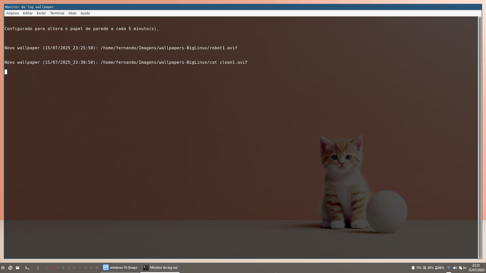

# sway-conf

Este repositório contém uma série de configurações personalizadas para o Sway, o gerenciador 
de janelas para Wayland. 




```
Script para alterar o papel de parede a cada X minutos no Sway (randomizar wallpapers)


1-

Configuração para TODOS os usuários

exec_always --no-startup-id sh -c 'pkill -f random_wallpaper_sway.sh; sleep 0.5; /usr/local/bin/random_wallpaper_sway.sh &'


Configuração individualizada para cada usuário

$ mkdir -p ~/.config/sway/scripts/

$ cp /usr/local/bin/random_wallpaper_sway.sh ~/.config/sway/scripts/

exec_always --no-startup-id bash -c 'cd ~/.config/sway/scripts/ && killall random_wallpaper_sway.sh ; ./random_wallpaper_sway.sh &'


O sleep 0.5 dá um tempo mínimo para pkill fazer efeito antes de iniciar novamente.


Obs: Evite intervalos muito curtos (menos de 5 min).

Ex: INTERVAL=5 em random_wallpaper_sway.sh


2- Comenta tudo relacionado ao Azote

Usando o Azote para gerenciar os papéis de parede

exec_always --no-startup-id ~/.azotebg &

3- No Wofi busca por "monitor" deve aparecer "Monitor de log wallpaper" para o idioma pt_BR.

```


